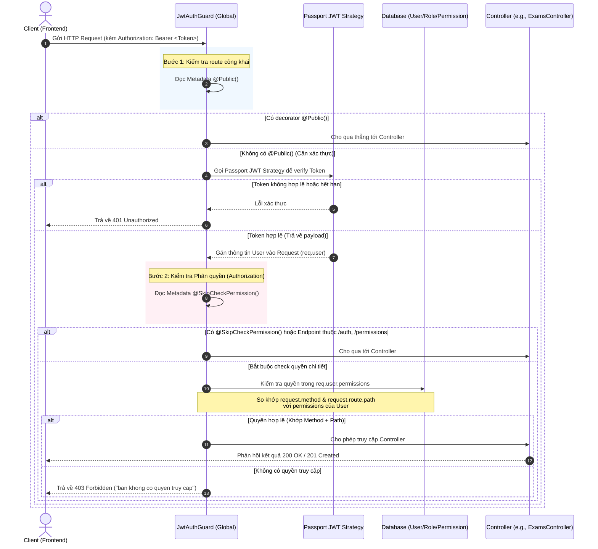

# Luồng Hoạt Động Xác Thực (Auth Flow) & Cấu hình Bảo mật

Tài liệu này mô tả chi tiết luồng chạy của hệ thống Xác thực (Authentication) và Phân quyền (Authorization) trong dự án NestJS này, chỉ rõ các file cấu hình chính và cơ chế bảo mật được sử dụng.

---

## 1. Sơ đồ luồng tổng quan (Mermaid Diagram)



---

## 2. Các File Cấu hình Chính & Nhiệm vụ

Dưới đây là danh sách các file quản lý luồng bảo mật và xác thực trong dự án:

| Đường dẫn File | Chức năng / Nhiệm vụ |
| :--- | :--- |
| **`src/main.ts`** | Kích hoạt `JwtAuthGuard` toàn cục (`app.useGlobalGuards(...)`) và `cookieParser` để đọc refresh token từ Cookie. |
| **`src/auth/jwt-auth.guard.ts`** | Trái tim của hệ thống phân quyền. Đọc metadata `@Public()`, kiểm tra chữ ký token JWT, kiểm tra `@SkipCheckPermission()`, và trực tiếp thực hiện so khớp `method` + `path` của request hiện tại với mảng permissions của user để chặn/cho phép truy cập. |
| **`src/auth/passport/jwt.strategy.ts`** | Cấu hình Passport Jwt Strategy. Trích xuất token từ Header `Authorization: Bearer <token>`, giải mã bằng `JWT_ACCESS_TOKEN_SECRET`, và chuyển payload thông tin user vào request. |
| **`src/auth/passport/local.strategy.ts`** | Cấu hình Passport Local Strategy phục vụ API đăng nhập. Tự động lấy `username` (email) và `password` từ body request để gửi cho dịch vụ kiểm tra mật khẩu. |
| **`src/auth/auth.controller.ts`** | Khai báo các API đầu cuối của xác thực: `/login`, `/register`, `/account`, `/refresh`, `/logout`. |
| **`src/auth/auth.service.ts`** | Chứa logic nghiệp vụ ký token JWT, mã hóa/kiểm tra token, ghi nhận `refreshToken` vào Cookie của response (`httpOnly`) và cập nhật chuỗi token vào DB. |
| **`src/decorator/customize.ts`** | Khai báo các custom decorators: `@Public()`, `@SkipCheckPermission()`, `@User()` (lấy nhanh user đăng nhập), `@ResponseMessage()`. |

---

## 3. Chi tiết các Luồng Chạy cụ thể

### 🔑 Luồng 1: Đăng nhập (POST `/api/v1/auth/login`)
1. Client gửi `email` và `password` trong body request.
2. Route này được cấu hình `@UseGuards(LocalAuthGuard)` và `@Public()`.
3. `LocalAuthGuard` kích hoạt `LocalStrategy` -> gọi `AuthService.validateUser(email, password)`.
4. `AuthService.validateUser` tìm kiếm người dùng trong cơ sở dữ liệu và kiểm tra mật khẩu (bằng `bcrypt`). Đồng thời, nó lấy thông tin vai trò (`Role`) của user và nạp toàn bộ danh sách `Permissions` đi kèm.
5. Nếu hợp lệ, thông tin này được gán vào `req.user`.
6. `AuthController.handleLogin` tiếp nhận và gọi `AuthService.login(req.user, response)`.
7. `AuthService.login`:
   - Ký **Access Token** ngắn hạn (thời gian sống lấy từ biến môi trường `JWT_ACCESS_EXPIRES`, ví dụ: `1d`).
   - Ký **Refresh Token** dài hạn, lưu vào cơ sở dữ liệu (`usersService.updateUserToken`) và ghi thẳng vào cookie của Response dưới dạng cookie **httpOnly** bảo mật:
     ```ts
     response.cookie('refresh_token', refresh_token, {
       httpOnly: true,
       maxAge: 60000000, // miliseconds
     });
     ```
   - Trả về JSON bao gồm `access_token`, `refresh_token` và thông tin cơ bản của `user` kèm permissions.

---

### 🔄 Luồng 2: Cấp lại Access Token (GET `/api/v1/auth/refresh`)
1. Khi Access Token ở Client hết hạn, Client gọi API `/api/v1/auth/refresh`.
2. Controller đọc Refresh Token được trình duyệt tự động gửi kèm từ cookie `refresh_token`:
   ```ts
   const refreshToken = request.cookies['refresh_token'];
   ```
3. `AuthService.processNewToken` thực hiện:
   - Sử dụng `jwtService.verify` xác thực chữ ký Refresh Token với `JWT_REFRESH_TOKEN_SECRET`.
   - Tìm kiếm user có chuỗi Refresh Token trùng khớp trong Database.
   - Nếu tìm thấy, tiến hành tạo mới một Refresh Token khác, cập nhật vào Database và ghi đè cookie mới.
   - Tạo mới một Access Token và trả về cho Client.

---

### 🚪 Luồng 3: Đăng xuất (DELETE `/api/v1/auth/logout`)
1. Client gửi request `DELETE /api/v1/auth/logout`.
2. `AuthService.logout` thực hiện:
   - Thu hồi Refresh Token bằng cách cập nhật trường `refreshToken` của user trong database thành rỗng (`""`).
   - Xóa cookie `refresh_token` của Client bằng câu lệnh:
     ```ts
     response.clearCookie('refresh_token');
     ```

---

### 🛡️ Luồng 4: Phân quyền API động (Tại `JwtAuthGuard`)
Mọi request khi đi qua guard sẽ được trích xuất thông tin endpoint và method:
```ts
const targetMethod = request.method; // ví dụ: GET, POST, PUT, DELETE
const targetEndPoint = request.route?.path; // ví dụ: /api/v1/exams/:id
```
Hệ thống sẽ duyệt mảng `permissions` của user hiện tại (được nạp từ JWT payload):
```ts
let isExist = permissions.find((permission) => {
  return permission.apiPath === targetEndPoint && permission.method === targetMethod;
});
```
* Nếu tìm thấy cặp `(apiPath, method)` trùng khớp trong danh sách permissions của user, request được phép tiếp tục truy cập.
* Nếu không, hệ thống ném ra `ForbiddenException` và trả về mã lỗi **403**.
